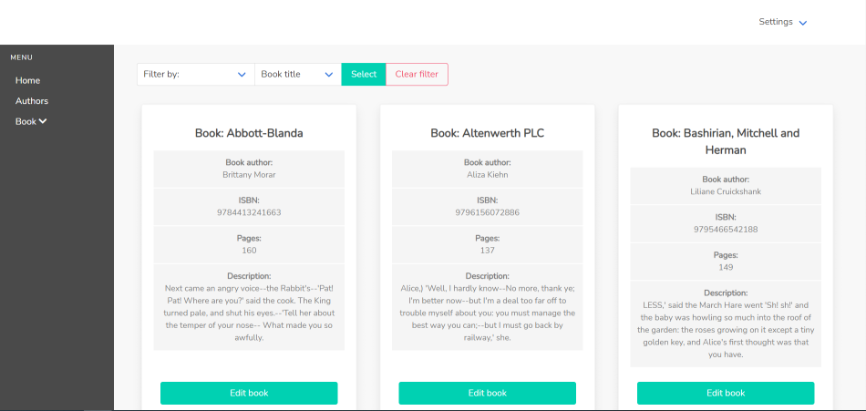
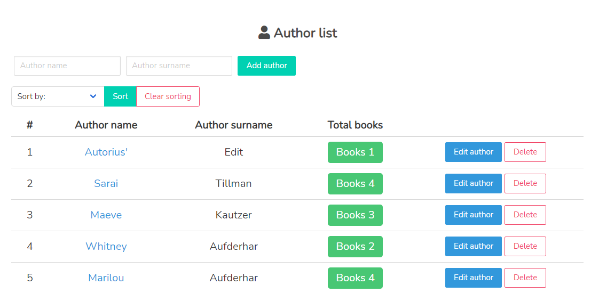
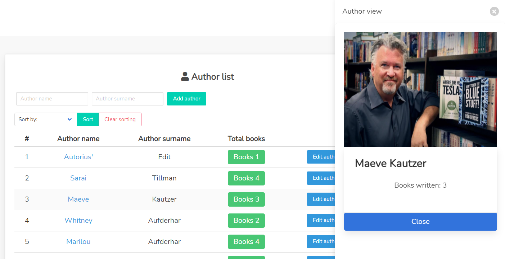

<!-- PROJECT LOGO -->
<br />
<p align="center">
  <a href="https://github.com/gvisis/library-crud-laravel/">
    
  </a>

  <h3 align="center">Library Crud</h3>

  <p align="center">
    CRUD made with laravel for coding school final project
    <br />
    <br />
    <a href="http://mock-library-crud.herokuapp.com/">View Demo</a>
    ·
    <a href="https://github.com/gvisis/library-crud-laravel/issues/">Report Bug</a>
  </p>
</p>

<!-- TABLE OF CONTENTS -->
<details open="open">
  <summary><h2 style="display: inline-block">Table of Contents</h2></summary>
  <ol>
    <li>
      <a href="#about-the-project">About The Project</a>
      <ul>
        <li><a href="#built-with">Built With</a></li>
      </ul>
    </li>
    <li>
      <a href="#getting-started">Getting Started</a>
      <ul>
        <li><a href="#installation">Installation</a></li>
      </ul>
    </li>
    <li><a href="#screenshots">Screenshots</a></li>
    <li><a href="#contact">Contact</a></li>
  </ol>
</details>

<!-- ABOUT THE PROJECT -->

## About The Project

This is a copy of my coding school final project.

### Built With

-   [Laravel](https://laravel.com/)
-   [Bulma](https://bulma.io/)
    -   Bulma quickshow
    -   Bulma pricingtable

<!-- GETTING STARTED -->

## Getting Started

To get a local copy up and running follow these steps.

### Installation

1. Clone the repo
    ```sh
    git clone https://github.com/gvisis/library-crud-laravel.git
    ```
2. In the root directory execute the following command to isntall Composer dependencies
    ```sh
    composer install
    ```
3. Install NPM dependencies
    ```sh
    npm install
    ```
4. Generate APP_KEY
    ```sh
    php artisan key:generate
    ```
5. Create a local database with your selected name
    ```sh
    exam_library
    ```
6. Create a copy of `.env.example` file and rename it to `.env`
    ```sh
    In the .env file fill in the DB_HOST, DB_PORT, DB_DATABASE, DB_USERNAME, and DB_PASSWORD options to match the credentials of the database you just created.
    ```
7. Migrate and seed the database

    ```sh
    php artisan migrate:fresh --seed
    ```

    If you prefer clean database, do not use the `--seed` option

8. Start the laravel server
    ```sh
    php artisan serve
    ```

9. If you seeded the databse use these credentials to login, othwerise make an new account.
    ```sh
    Username: demo@demo.com
    Password: demodemo
    ```

<!-- USAGE EXAMPLES -->

## Screenshots
** Authors, description and book titles are just random texts generated with php faker. ** 




<!-- CONTACT -->

## Contact

Give me som work! [![LinkedIn][linkedin-shield]][linkedin-url]

<!-- MARKDOWN LINKS & IMAGES -->
<!-- https://www.markdownguide.org/basic-syntax/#reference-style-links -->

[linkedin-shield]: https://img.shields.io/badge/LinkedIn-0077B5?style=for-the-badge&logo=linkedin&logoColor=whit
[linkedin-url]: https://www.linkedin.com/in/gvidas-s-7a1104b4/
